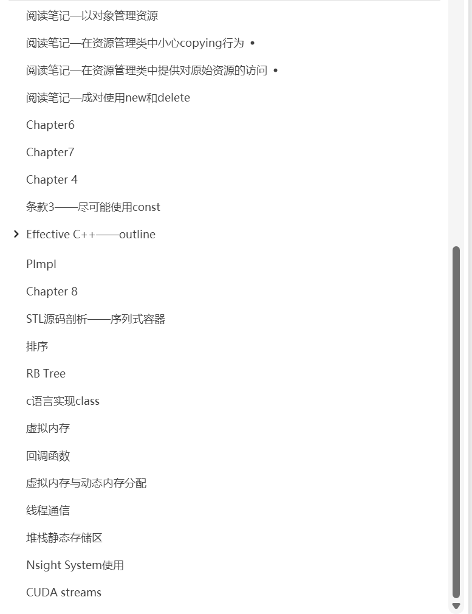

# Blog
zzy newbee

## Before All
特别感谢[小彭老师](github@archibate)教学的C++课程和CUDA课程，希望小彭老师在知识大同的路上越走越远！(以后我一定用Arch抛弃ubuntu)
CUDA学习主要是通过官方文档和小彭老师的教程，以及我师兄王昊天亲历亲为的指导
感谢[卡尔老师](https://www.programmercarl.com/)的代码随想录

## Intro
Serveral fully handmade and mixed notes，wish me a good luck in my exlporation
Uploading（from Onenote to vscode markdown, and finally Typora

## Sort（commonplace
代码实现及扩展

## c++ from rookie to rookie
涵盖超广泛，从c++基础到c++进阶，从leetcode到cuda，还有nsight等超多笔记
前期通过onenote记录，后续会逐渐总结至markdown
当前pdf没有目录，在此附上

## Docker学习
[狂神](https://www.bilibili.com/video/BV1og4y1q7M4/?spm_id_from=333.337.search-card.all.click)讲的真好啊

## 网络编程板块
- IO多路复用
- Reactor网络模型原理

## 现代cmake学习
- 源自小彭老师课程
